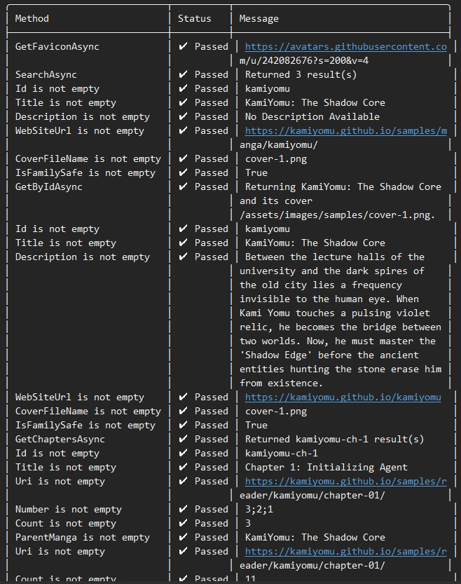

# KamiYomu Crawler Agent – kamiyomu.com (Sample)

This repository contains a **sample Crawler Agent** for the KamiYomu ecosystem.

The agent demonstrates how to fetch manga files from the  
[KamiYomu Sample Manga Library](https://kamiyomu.com/samples/gallery/),  
which hosts **sample-only manga content** for development and testing purposes.

---

## Purpose

This project is intended to help developers:

- Understand how a KamiYomu Crawler Agent is structured
- Create their own custom crawler agents
- Validate crawler behavior before integration with KamiYomu

---
## Project References

### KamiYomu.CrawlerAgents.Sample.csproj
- Serves as a guide for creating your own crawler agent.
- Each time you build this project, it generates a NuGet package at:

src/KamiYomu.CrawlerAgents.Sample/bin/Debug/KamiYomu.CrawlerAgents.Sample.1.0.0.nupkg

- You can install this package directly in your KamiYomu instance for testing or reference.

---

### KamiYomu.CrawlerAgents.ConsoleApp
- Acts as a validator for your crawler agent.
- You do not need to test your agent directly in KamiYomu; running the console app ensures your agent behaves correctly.

---

### KamiYomu.CrawlerAgents.Core
A foundational library for building, extending, and integrating custom crawler agents within the KamiYomu ecosystem.
It provides essential abstractions, utilities, and lifecycle hooks to streamline agent development and ensure seamless interoperability across the platform.

Installation via NuGet:

dotnet add package KamiYomu.CrawlerAgents.Core

Make your package discoverable by KamiYomu:
Add package tags to your .csproj:

<PropertyGroup>
    <PackageTags>crawler-agents;manga-download</PackageTags>
</PropertyGroup>

Create your custom crawler agent:

1. Implement the ICrawlerAgent interface from the KamiYomu.CrawlerAgents.Core namespace.
2. Implement the required lifecycle methods (Crawl, ExtractMetadata, etc.).
3. The interface defines how KamiYomu will interact with your agent.

Use the Sample project as a reference implementation to guide your development.

### ✅ Validator / Test Harness
To validate your crawler agent locally, use:

- `KamiYomu.CrawlerAgents.ConsoleApp.csproj`

If your crawler agent **passes all validation checks** in the console app, it should be fully compatible with KamiYomu.

---

## Workflow Overview

1. Use the **Sample Crawler Agent project** as a template
2. Implement your custom crawling logic
3. Run the **Console App validator**
4. Ensure all checks pass
5. Integrate your crawler agent with KamiYomu

---

## Documentation

For full documentation, implementation details, and best practices, see:

👉 **KamiYomu Crawler Agent Docs**  
https://kamiyomu.com/docs/crawler-agents/crawler/

---

## Notes

- This repository is for **educational and development purposes**
- Sample content only — no production manga sources are included
- Designed to be extended, not used as-is

---
